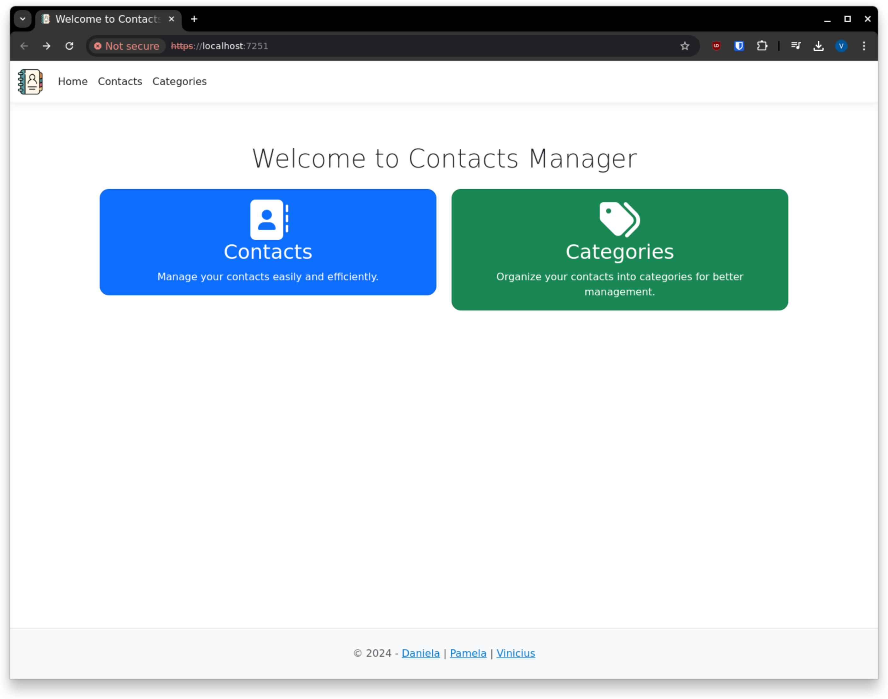
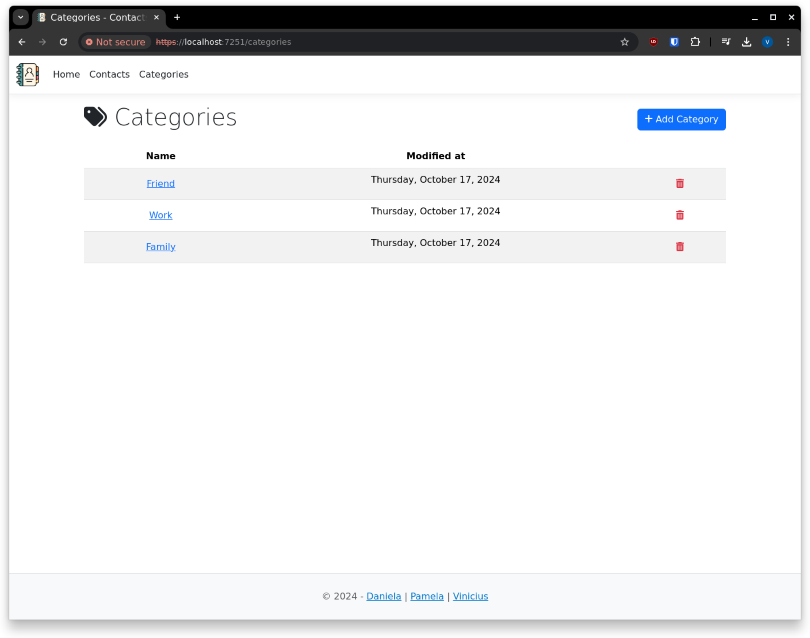
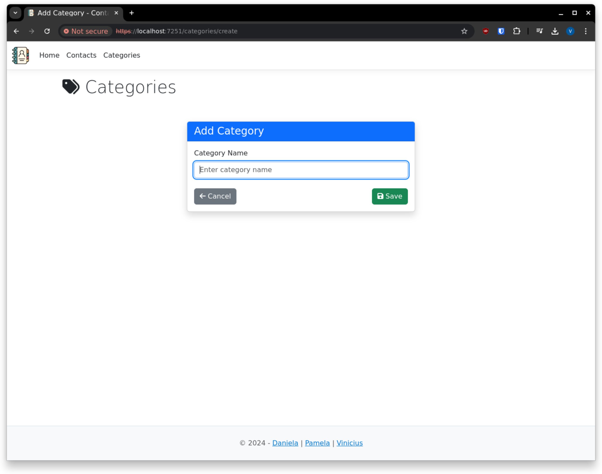
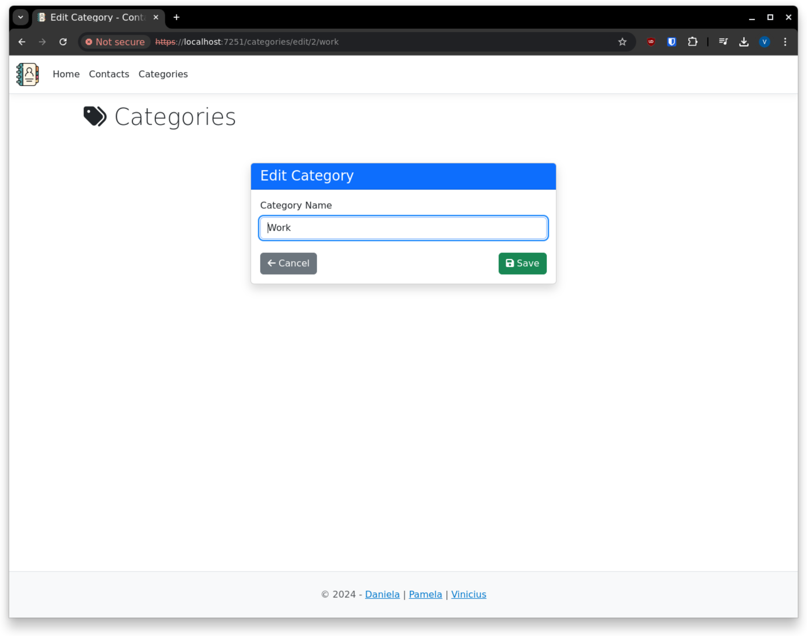
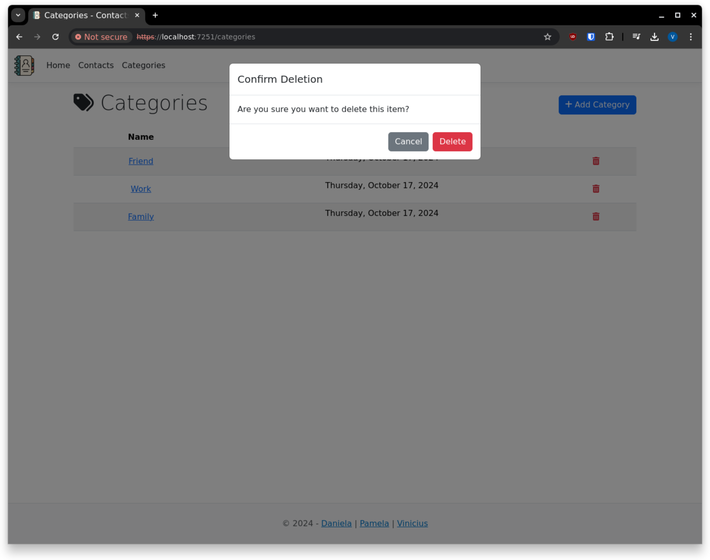
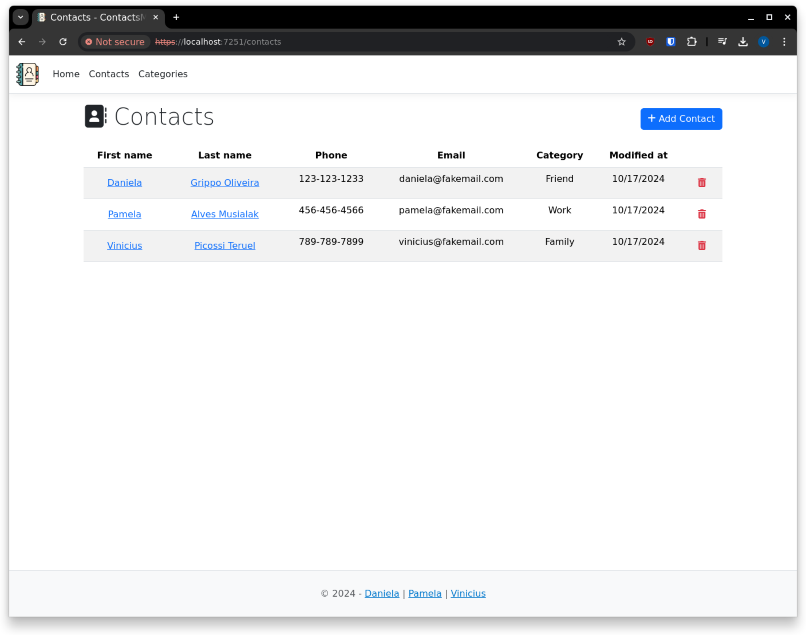
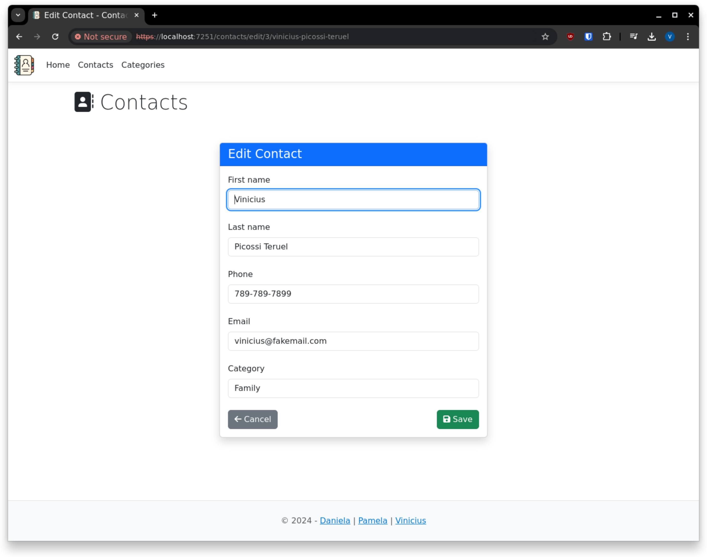
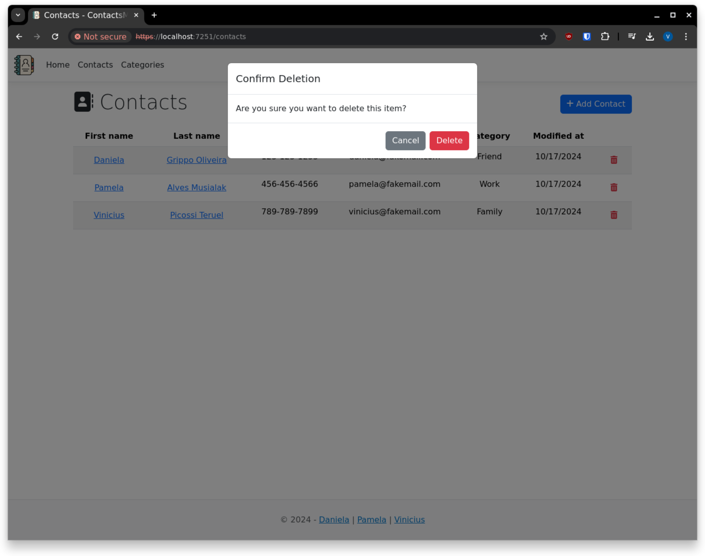

# Contacts Manager App

## Overview

Contacts Manager App is a simple web application that allows users to manage categories and contacts. This app is built using ASP.NET Core MVC with a SQL Server database and includes features such as adding, editing, and deleting categories and contacts. It also uses Bootstrap for responsive design and Font Awesome for icons.

## Features

- **Manage Categories**: View, add, edit, and delete categories.
- **Manage Contacts**: View, add, edit, and delete contacts.
- **Responsive UI**: Built with Bootstrap for modern design and mobile responsiveness.
- **Icon Integration**: Uses Font Awesome icons to enhance the UI.

## Screenshots

1. **Welcome Page**
   

2. **View Categories**
   

3. **Add Category**
   

4. **Edit Category**
   

5. **Delete Category**
   

6. **View Contacts**
   

7. **Add Contact**
   

8. **Edit Contact**
   

9. **Delete Contact**
   

## How to Run the Project

1. Clone the repository to your local machine.
2. Navigate to the project directory and open it in your preferred IDE.
3. Ensure that you have SQL Server installed and update the connection string in the `appsettings.json` file.
4. Run the migrations to set up the database schema.
5. Run the project.

## Technologies Used

- **ASP.NET Core MVC** for the web application framework.
- **Entity Framework Core** for database access.
- **SQL Server** for the database.
- **Bootstrap** for the UI design.
- **Font Awesome** for icons.

## Contact

Feel free to reach out if you have any questions or suggestions for improvements.

---

### Authors

- Daniela | [Pamela](https://github.com/danielaoliveira90)
- Pamela | [Pamela](https://github.com/pamusialak)
- Vinicius | [Vinicius](https://github.com/vpteruel)
